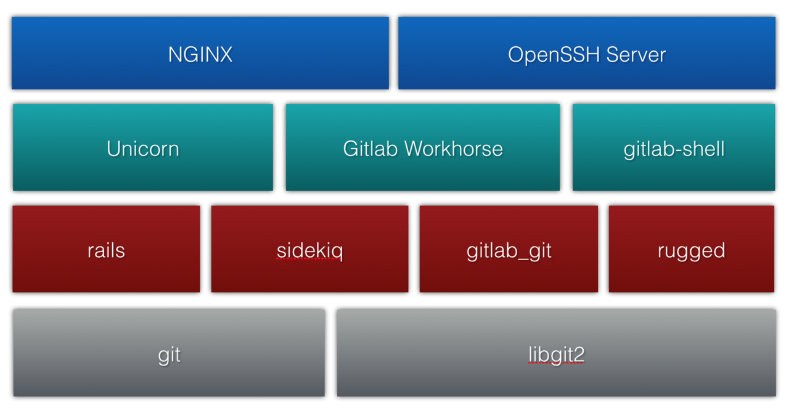

# 基于 GitLab 构建面向中小团队的高可用的持续集成服务

## 0.共识

关于高可用的方案的讨论，建立在以下共识基础上：

* 高可用度要求越高，其方案则越复杂，需要投入的建设和维护的成本也越高。
* 不存在100%高可用的系统。
* 自动化恢复机制除了带来高效率，同时也提高了数据丢失的风险。
By configuring auto-recovery policies, you are effectively configuring automatic data-loss!-- DRBD user guide

## 1.需求

本文主要针对以下需求，描述解决方案。其他场景，如千人级团队、跨地域协作等，不适用。

* 团队：支持100人共同使用。
* 环境：局域网内应用，不跨地域，不跨网络。
* 高可用：保证数据的高可用，接受服务有小时级的维护窗口。
* 复杂度：减少系统的复杂度，易维护，因没有专职的 CI 维护工程师。

## 2.方案

### 2.1 推荐方案

方案：准实时的仓库数据同步+配置备用环境。

### 2.2 其他候选方案

## 3.实施

## 4. GitLab 架构图

* libgit2 (a portable, pure C implementation of the Git core methods provided as a re-entrant linkable library with a solid API,) https://libgit2.org/
* 

## 5. DRBD

DRBD（Distributed Replicated Block Device是一个用软件实现的、无共享的、服务器之间镜像块设备内容的存储复制解决方案。
数据镜像：实时、透明、同步（所有服务器都成功后返回）、异步（本地服务器成功后返回）。
DRBD的核心功能通过Linux的内核实现，最接近系统的IO栈，但它不能神奇地添加上层的功能比如检测到EXT3文件系统的崩溃。

## 6. 参考

* GitLab关于高可用的解决方案 <https://about.gitlab.com/solutions/high-availability/>
* GitLab关于高可用配置的手册 <https://docs.gitlab.com/ee/administration/high_availability/README.html>
* GitLab 高可用 <http://www.mamicode.com/info-detail-2410237.html>
* GitLab 扩展与高可用 <https://chegva.com/3234.html>
* GitLab 官方的生产架构 <https://about.gitlab.com/handbook/engineering/infrastructure/production-architecture/>
* DRBD <https://baike.baidu.com/item/DRBD/7342076?fr=aladdin>