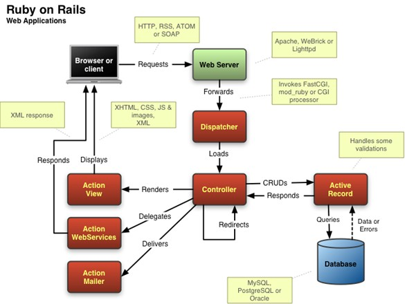

# Redmine：如何发邮件提醒？

## 需求

登录Redmine后，在“我的工作台”里能看到与自己相关的内容。这种模式属于“拉取式”。好处是不打扰开发者，弊端是面对响应会不及时。

作为补充，需要能提供“推送式”信息服务。

方案：利用邮箱软件的提醒功能，实现消息的推送。

## 配置流程

1. 获取邮箱服务商配置信息
2. 配置 Redmine 服务所在机器上DNS 服务信息
3. 配置为 Redmine 配置邮件服务信息
4. 验证结果

## Redmine 的部署结构

浏览器 -> httpd/lighttpd -> Ruby on Rails -> MySQL

## 配置过程

1. 获取邮箱服务商配置信息

https://qiye.163.com/help/client-profile.html

2. 配置 Redmine 服务所在机器上DNS 服务信息
3. 配置为 Redmine 配置邮件服务信息
4. 验证结果

## 思考题

由于 Redmine 每天的业务量很大时，会触发发送大量邮件。如果被邮件服务器

## 扩展阅读

* http://rubyonrails.org/
* 