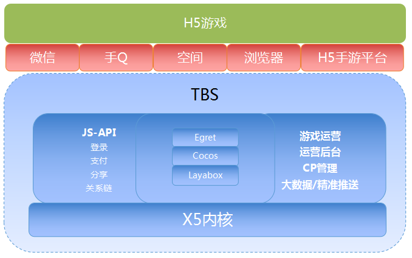

# 微信开发者官方链接

## [微信支付-开发文档-普通商户接入](https://pay.weixin.qq.com/wiki/doc/api/index.html)

## [微信公众平台接口调试工具](https://mp.weixin.qq.com/debug/)

## [微信官方文档](https://developers.weixin.qq.com/doc/)

含小程序、小游戏、公众号、智能对话、开发平台

## [小程序WeUI组件库](https://github.com/wechat-miniprogram/weui-miniprogram)

## [WeUI](https://weui.io/)

GitHub:[https://github.com/Tencent/weui](https://github.com/Tencent/weui)

A UI library by WeChat official design team, includes the most useful widgets/modules in mobile web applications.
WeUI 是一套同微信原生视觉体验一致的基础样式库，由微信官方设计团队为微信内网页和微信小程序量身设计，令用户的使用感知更加统一。

## [测试号管理](https://developers.weixin.qq.com/sandbox)

## [腾讯浏览服务](https://x5.tencent.com/tbs/index.html#)

https://x5.tencent.com/tbs/product/tbs.html

HTML5能力：
腾讯浏览服务提供完善的HTML5能力支持。特别是，腾讯浏览服务针对canvas, webGL的渲染能力和性能大大优于传统内核，能够有效支持复杂的HTML5手游（包括基于HTML5的3D, VR类游戏）实现不逊色于Native的性能体验。基于腾讯浏览服务的HTML5游戏可以流畅运行于国内市场占有率领先的HTML5手机游戏渠道，包括手机QQ浏览器页游平台、手机QQ空间玩吧等。
