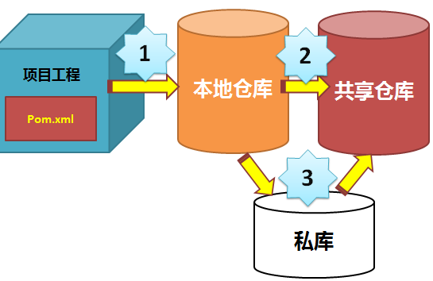

# 关于引入开源技术的一些建议

## 序言

在产品研发过程中，经常有一些所需的基础组件模块，推测有一定的通用性，于是我们会考虑引入一些开源技术。此时如何引入就需要一些注意点，包括：

### 对开源技术的可用性负责

开源技术引入系统后，属于系统的一部分，自此你需要对它的可用性负责。需要将这些代码当做自己的代码管理起来，包括源码、依赖库、组件包、相关文档等。开源技术社区是不做任何可用性的承诺的。

### 开源技术的技术成熟度

开源技术的起因千差万别，其发展历程更是各有各的故事。开源只是代码公开，提供了一种利用群众的力量来发现问题、解决问题的能力，但是否能转换为实际，真的很难。对于普通开源技术，更多的价值是提供了一种设计参考，一种技术迭代的基础。

### 许可授权的范围

开源不等于免费，不同的授权，不同的使用方案。开源领域的授权协议五花八门，即使你仔细研究半天，也未必能理解，它最终是怎么授权你使用。如果你开发的是商业软件，则需要注意一下，避免不必要的麻烦。

## 引入开源技术的 4 个阶段

这里提供一些思路，以抛砖引玉。

### 阶段 1：技术选型

此阶段为粗筛，去掉一些明显有风险的选型，以便下一步能聚焦在更有价值的候选项上。每个组织的的选型要求不同，但事先确定一些标准，然后针对候选项逐一评估，会让选型更有条理、更可靠。如

| 选型标准 | GitHub star数 | 版本发布周期 | 社区活跃度 | 开发语言 | 依赖库分析 | 文档可用性 | 授权协议 | 应用案例 | 第三方评测数据 |
|:--:|:--:|:--:|:--:|:--:|:--:|:--:|:--:|:--:|:--:|
|方案1|……|……|……|……|……|……|……|……|……|
|方案2|……|……|……|……|……|……|……|……|……|
|方案3|……|……|……|……|……|……|……|……|……|

### 阶段 2：技术实测

在初步选型后，需要实际测试的范围就缩小很多。这时需要从自己的应用场景中，抽象出一组测试场景，并验证其可用性。包括：

* 开发难易：上手实际写一下，便于掌握使用的复杂度。
* 场景支持度：不需要全，但需要有代表性；不需要真接入系统，模拟测试即可。
* 性能：不同负载下的性能表现，0.5x、1.0x、1.2x、1.5x……
* 稳定性：给定负载下的，稳定运行结果，包括是否宕机，内存是否正常等。

### 阶段 3：工程应用

#### 场景一：多人协作时

现代软件更多是多人协作开发，在引入新的开源技术后，需要将其引入到团队中，避免一下导致其他伙伴都编译失败，各种抱怨。如果不需要他人关注，则做好隔离设计即可。

#### 场景二：基础组件的基础化

通常使用基础组件时，只需要一次编译发布即可，后续简单引入即可，即降低了编译效率，也保证了组件的品质（重复编译的结果不一定一致）。

#### 场景三：酌情融入到团队的基础设施中

例如团队使用Maven来做包管理，则遵从团队的工程实践规则，将引入的开源技术的包管理，妥善解决由此引发的一些冲突问题。

### 阶段 4：回馈社区

开源是一种技术精神，作为开发者，我们既要积极使用开源技术，同时也要基于自己的能力，积极将使用中问题、尝试的改进回馈到社区，促进后续的版本解决自己的问题。
