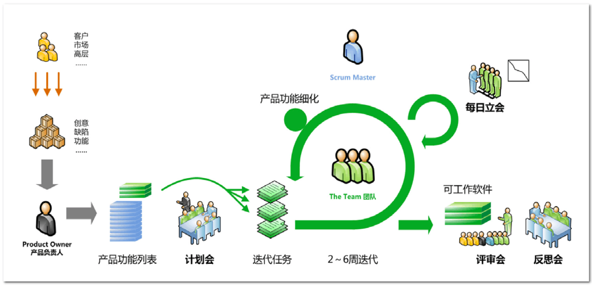

# 敏捷导引

## 1. 为什么要关注敏捷

### 1.1 响应市场的研发变革

* 更快变化：市场、竞争、资本、技术、社会
* 顺势而为：为了生存而不得不适应

敏捷的起因是软件行业的自我进化，是面对不断加速的需求变更与技术复杂度双重挑战下的管理实践，希望借助一些方法论上的变化，适应变化。时至今日，我们所处的环境的变化在不断加速中，从市场、竞争、资本、技术、社会等方方面面都在经历着快速的演进。尤其是云计算的普及应用，进一步加剧了变化的加速。一个业务从灵感到上市可能是倍速的提升，进而要求其他市场的参与者也同步加速应对。变化无法拒绝，只有顺势而为，跟随变化，把握变化带来的机遇。

### 1.2 敏捷引发的采购变革

**资金的来由：**年度预算 vs 市场驱动
大部分企业的采购资金来自按年编制的年度预算，面对现在的环境，越来越多面临预算编制难，调整周期长的内部挑战，业务发展强烈需要由市场驱动来安排资金。

**资金的使用：**批量采购 vs 碎片化采购

根据年度预算，企业很容易实现批量采购，从而实现采购成本的降低，但受变化的影响，决策风险提升高，采购到位的产品不一定是业务当时需要的，造成资产闲置，最终的总体费用不一定低。碎片化采购模式导致在单次采购时，企业缺少谈判的话语权，采购单价难以控制，但由于按需采购，减少了资产闲置、过度采购的情况的发生。总体的费用也不一定低。

**资金的决策：**集中采购权 vs 下沉采购决策

按需付费导致业务人员实质决定了费用的发生。之前采购源自层层的审核，先审核后花费，而采用云计算模式后，业务一线人员的操作模式有可能会导致业务的费用有重大的差别，他们是最了解采购需求的人，也是最有可能优化使用模式的人，但却没有采购权，导致需求和决策分离，决策的质量和效率都面临挑战。业务呼吁下沉采购决策。

### 1.3 敏捷 –DevOps 之基

> Change => 敏捷 => 持续交付 => 持续部署 => DevOps

DevOps 是这几年运维岗位不断讨论和探索的实践。但业务的发展需要一个循序渐进的过程，敏捷解决了产品研发环节的效率问题，进而引发借助持续发布支持产品的持续销售的可能，而持续部署又进一步将软件的价值直接呈现在客户面前，实现了需求到价值的加速流转。而这一切的累计必然会面临部门间的协作问题，在推进敏捷、持续发布、持续部署过程中就孕育着 DevOps 的推行和实践。而且敏捷、持续部署、DevOps 等彼此借鉴相互提升，边界已经比较模糊。

### 1.4 敏捷 – 不止于产品

敏捷是一类方法论，不局限于产品研发、技术服务等传统敏捷适用场景。精益创业、MVP 等都是敏捷思想在企业经营领域的探索。

## 2. Scrum 的 “3355”

敏捷有很多种实践，但目前流行度最高的是 Scrum，本文后续以 Scrum 为例介绍敏捷具体是什么。Scrum 核心可以简化为 “3355”，即 3 个角色，3 个工件，5 个活动，5 个价值观。具体可以参考 Scrum 指南。这些都可以理解为一些最佳实践，而不是束缚你实践的条条框框。在理解每项背后的初衷后，其具体落地实践就可以因地制宜了。

| 3 种角色 | 3 个工件 |  5 个活动  | 5 个价值观|
|-|-|-|-|
|Product Owner 产品负责人|Product Backlog 产品待办清单|Sprint 冲刺|Courage 勇气|
|Development Team 开发团队|Sprint Backlog 迭代待办项列表|Sprint Planning Meeting 规划会 |Openness 开放|
|Scrum Master 敏捷教练|Increment 可交付产品增量|Sprint Daily Standup每日站会|Focus 专注|
| ||Sprint Review 评审会|Commitment承诺|
| ||Sprint Retrospective 回顾会|Respect尊重|

## 3. Scrum 框架

Scrum 围绕着 Sprint 冲刺展开，从需求的管理、版本规划的制定，再到版本的开发，和传统工作模式有一些差别。最核心的是对 Sprint 这个时间盒的理解和认同，以及由此产生的相关影响的接受和遵循。这里面的核心 2 个因素，一是 Development Team 的形成，要求很高，需要很长时间的不断打磨，另一个是能容纳 Scrum 的组织氛围或环境，允许 Scrum 团队有一些不同。针对后者，很多实践是对内敏捷，对外用传统项目管理的模式来封装，从而实现夹缝中生长。

## 4. 敏捷在京东-京麦的敏捷之旅

基于前面的介绍，大家对于敏捷依然还有一些抽象。下面的这段实践视频链接是京东的实践，能帮助大家大致感受一些采用 Scrum 后的工作模式。
[https://v.qq.com/x/page/o0155axsi5m.html](https://v.qq.com/x/page/o0155axsi5m.html)
