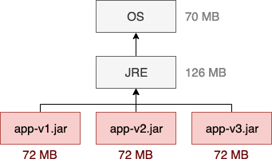
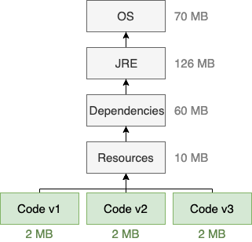
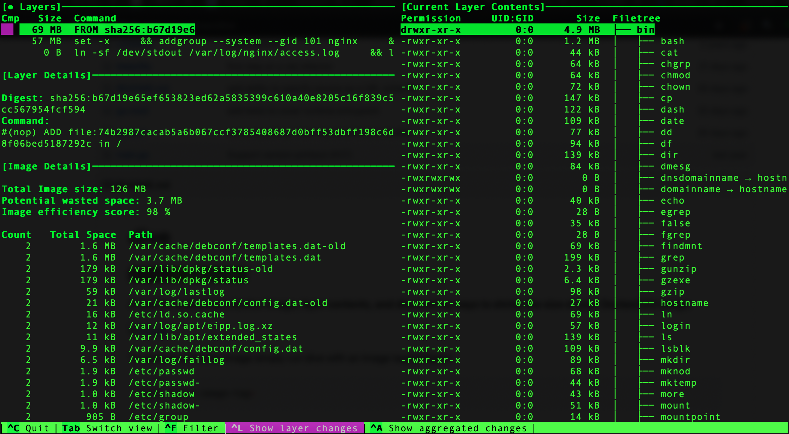

# 面向 JAR 的容器镜像尺寸优化的手段

> 感谢  https://phauer.com/2019/no-fat-jar-in-docker-image/
  https://www.infoq.cn/article/eULlQ4A3RcaLLQeImQy9

容器技术迷人之一是其轻量化，但如果容器镜像制作不佳，会导致不能充分发挥其优势。

对比两种做法对镜像尺寸的影响：
* 简单直接，但尺寸有优化的地方

* 层次调整，尺寸有改善


## 手段的依据：Docker 镜像的分层机制


* Bootfs: 用于引导系统，包括bootloader和kernel，容器启动完成后会被卸载以节约内存资源，可以理解就是Linux内核
* Base image: 基础镜像，例如像centos基础镜像，debian基础镜像，busybox基础镜像，表现为rootfs，可以理解为根文件系统
* Image :上层应用的镜像，例如Nginx，Mariadb等.....
* Container :前面几层都为只读层，这一层为可写层，运行为后容器会在这个docker的镜像上面多加一层可写的容器层，任何的对文件的更改都只存在此容器层。因此任何对容器的操作均不会影响到镜像。

## 手段的依据：对 JAR 文件内容的分解

一个大型的 JAR 包包含三个部分，变更频率有各自特点。

* 依赖项：占了很大的一部分比例，但很少发生改动。大多数时候只会修改我们的代码，很少会去修改依赖项。但依赖项每次都会被拷贝到发布版本中。
* 资源文件：和依赖项类似。虽然资源文件（HTML、CSS、图像、配置文件，等等）比依赖项更经常发生改动，但比起代码还是相对少一些。它们也会被拷贝到发布版本中。
* 代码：代码只占 JAR 包很小的一部分（通常 300KB 到 2MB），但会经常发生改动。

## 工具：可用来分析 Docker 镜像和可视化大型 JAR 对 Docker 镜像的影响

### 工具 1：docker history

扩展阅读：[https://docs.docker.com/engine/reference/commandline/history/](https://docs.docker.com/engine/reference/commandline/history/)

```bash
Usage: docker history [OPTIONS] IMAGE
Show the history of an image
Options:
      --format string   Pretty-print images using a Go template
  -H, --human           Print sizes and dates in human readable format (default true)
      --no-trunc        Don't truncate output
  -q, --quiet           Only show numeric IDs
```

示例如下：

```bash
$ docker history nginx
IMAGE               CREATED             CREATED BY                                      SIZE                COMMENT
540a289bab6c        11 days ago         /bin/sh -c #(nop)  CMD ["nginx" "-g" "daemon…   0B                  
<missing>           11 days ago         /bin/sh -c #(nop)  STOPSIGNAL SIGTERM           0B                  
<missing>           11 days ago         /bin/sh -c #(nop)  EXPOSE 80                    0B                  
<missing>           11 days ago         /bin/sh -c ln -sf /dev/stdout /var/log/nginx…   22B                 
<missing>           11 days ago         /bin/sh -c set -x     && addgroup --system -…   57MB                
<missing>           11 days ago         /bin/sh -c #(nop)  ENV PKG_RELEASE=1~buster     0B                  
<missing>           11 days ago         /bin/sh -c #(nop)  ENV NJS_VERSION=0.3.6        0B                  
<missing>           11 days ago         /bin/sh -c #(nop)  ENV NGINX_VERSION=1.17.5     0B                  
<missing>           2 weeks ago         /bin/sh -c #(nop)  LABEL maintainer=NGINX Do…   0B                  
<missing>           2 weeks ago         /bin/sh -c #(nop)  CMD ["bash"]                 0B                  
<missing>           2 weeks ago         /bin/sh -c #(nop) ADD file:74b2987cacab5a6b0…   69.2MB
```

### 工具 2：dive

扩展阅读：[https://github.com/wagoodman/dive](https://github.com/wagoodman/dive)

示例如下：

```bash
$ dive nginx
Fetching image... (this can take a while with large images)
Parsing image...
Analyzing image...
Building cache...
``` 



## 工具：帮助你优化镜像文件的工具 jib

Jib 是一个 Maven 或 Gradle 插件，用于简化 Java 应用程序镜像的打包过程。对于我们来说，Jib 最重要的一个特性是，它会扫描我们的 Java 项目，并为依赖项、资源文件和代码创建不同的层。

扩展阅读:[https://github.com/GoogleContainerTools/jib](https://github.com/GoogleContainerTools/jib)

### jib 的自我定义

> Jib builds optimized Docker and OCI images for your Java applications without a Docker daemon - and without deep mastery of Docker best-practices. It is available as plugins for Maven and Gradle and as a Java library.

